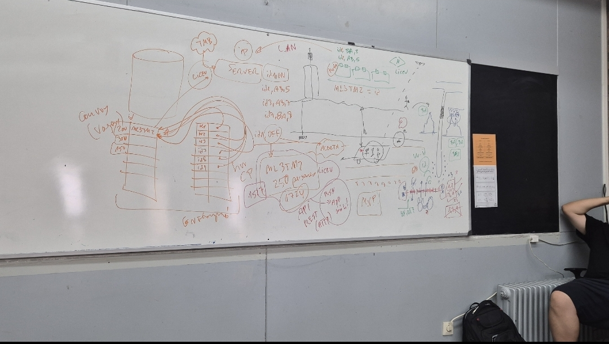

#  REPO test
Desenvolupament d'una aplicacio per saber la quantitat que tan ple va el metro de Barcelona
 

Documentació de la API de TMB "Incluyent autobusos"

(https://developer.tmb.cat/api-docs/v1)

Més dades per consultar de la API de TMB

(https://developer.tmb.cat/data)